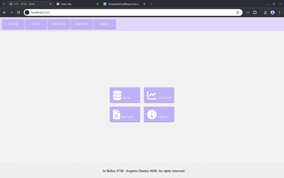
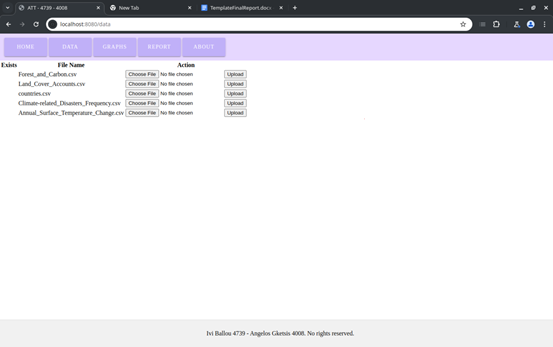
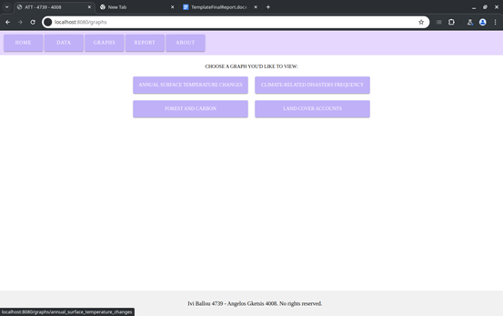
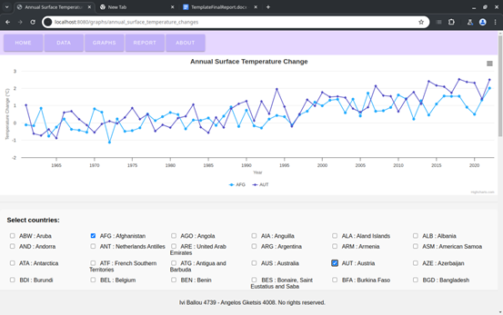
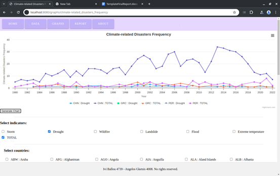
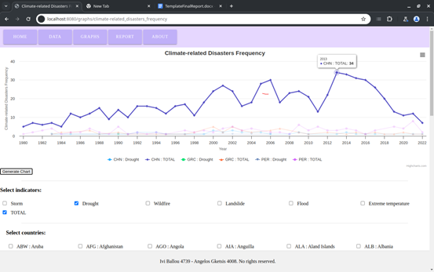
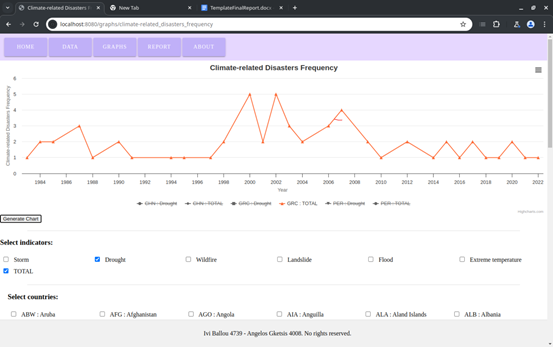
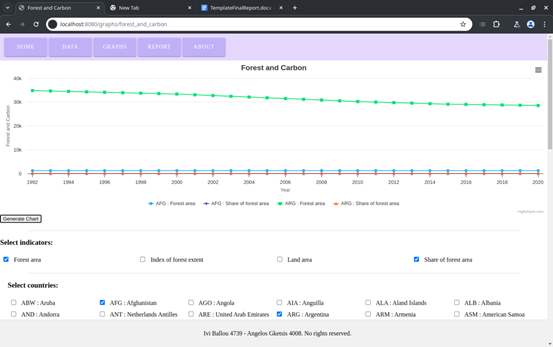
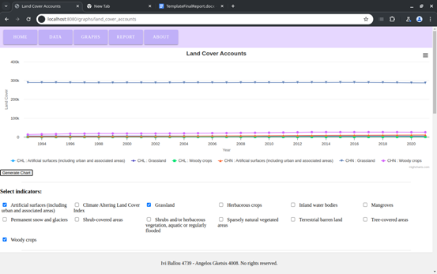

Charts Webapp
----
A simple web app, made using mariadb as a database and written in Spring Boot / Thymeleaf and Highcharts for charting.
It graphs country-related data into multiple types of graphs,\
after the user chooses the countries they'd like to display, alongside other related filters.

#### Features
 - Create and load database using user-provided CSVs
 - Display different graphs, after user chooses country and other related fields
 - Report section :P 

#### Some images that display the main functionality

Main Menu:\

CSV Upload:\

Graph Menu:\

Annual Surface Temperature Changes:\

Climate-related Disasters Frequency:\

Climate-related Disasters Frequency example 2:\

Climate-related Disasters Frequency example 3:\

Forest and Carbon:\

Land Cover Account:\

---

**UoI - Advanced topics in database technology and applications. Credits go to:**\
Άγγελος Γκέτσης / Angelos Gketsis - 340/4008 - database work           ( setting up DB, loading data, parsing CSV files   )\
Ήβη     Μπάλλου / Ivi     Ballou  - 340/4739 - backend & frontend work ( hooking to the DB, REST API work, frontend UI/UX )\
\
\
\
.
 
